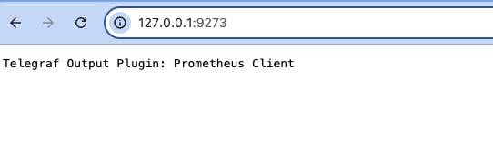
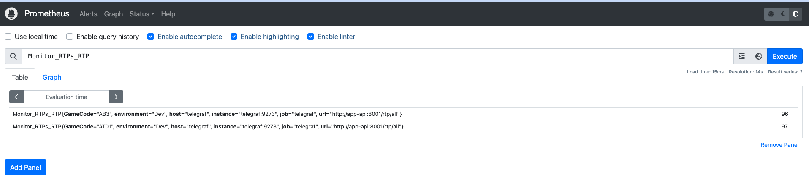
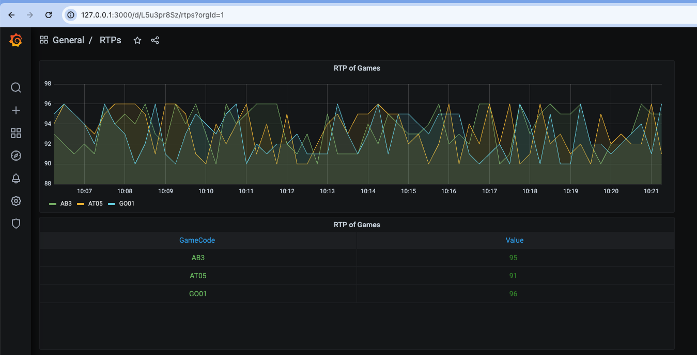

# 檢查RTP 數據 API


## make 啟動服務
```
make service-up
```
## make 啟動服務
```
make service-down
```
### 服務說明項目
|服務 |  使用目的 |
| --------  |-------- |
| checkRTPAPI  |本應用服務 檢查API |
| telegraf  |向 api 抓資料 並且轉換成 metics 格式 |
| prometheus  |向 telegraf 抓取 metrics 進行監控 |
| grafana  |視覺化呈現 |
| redis-cluster  |(redis-1~redis-6) |


## checkRTPAPI服務
```
只啟動API服務：
sh ./do.sh checkRTPAPI start
```

|URL| 協定 |  使用目的 |
| -------- | -------- |-------- |
| `/rtp/all`| `GET` | 取得所有遊戲RTP數據 （根據設定檔與redis資料都存在的話） |
| `/rtp?gamecode=AT01` | `GET` | 取得單一款RTP數據|
| `/clear/all` | `PUT` | 清空在reids上所有遊戲BET/WIN數據 （根據設定檔與redis資料都存在的話）|
| `/clear?gamecode=AB3`| `PUT` | 清空在reids上指定的遊戲BET/WIN數據 （根據設定檔與redis資料都存在的話）|
| `/health` | `GET` | 檢查服務）|
| `/health/redis` | `GET` | 檢查redis連線狀況|

## checkRTPAPI-定時排程說明
```
 "app.scheduleCleanRTP": "*/5 * * * *" 

 依據設定檔案cron 設定方式 進行/clear/all的服務
```

## **範例**

```
# @name GetRTPsAll
GET {{BASE_URL}}/rtp/all HTTP/1.1

//Response Example
{
  "RTPs": [
    {
      "GameCode": "AT01",
      "RTP": 96
    },
    {
      "GameCode": "GO02",
      "RTP": 97
    }
  ]
}
```
```
# @name GetRTPByGameCode
GET {{BASE_URL}}/rtp?gamecode=AT01 HTTP/1.1

//Response Example
{
  "RTPs": [
    {
      "GameCode": "AT01",
      "RTP": 96
    }
  ]
}
```

```
# @name ClearBetWinAll
PUT {{BASE_URL}}/clear/all HTTP/1.1

//Response Example
{
  "GameInfos": [
    {
      "GameCode": "AT01",
      "Message": "Clear Success"
    },
    {
      "GameCode": "AB3",
      "Message": "AB3-BET not found"
    },
    {
      "GameCode": "GO02",
      "Message": "Clear Success"
    }
  ]
}
```

```
# @name ClearBetWinByGameCode
PUT {{BASE_URL}}/clear?gamecode=AT01 HTTP/1.1

//Response Example
{
  "GameInfos": [
    {
      "GameCode": "AT01",
      "Message": "Clear Success"
    }
  ]
}
```

```
# @name checkHealth
GET {{BASE_URL}}/health HTTP/1.1

//Response Example
{
  "message": "ok!"
}
```

```
# @name healthRedisConnection
GET {{BASE_URL}}/health/redis HTTP/1.1

//Response Example
{
  "message": "PONG"
}
```

## telegraf 服務說明
http://127.0.0.1:9273/
```
shared-config/telegraf/telegraf.d/app-api.conf => API response 的資料抓取規則設定

shared-config/telegraf/telegraf.conf 
=> telegraf 的基本設定檔

```


## prometheus 服務說明
http://127.0.0.1:9090/
```
shared-config/prometheus/prometheus.yml 
=> 抓取 metrics 進行監控

```


## grafana 服務說明
http://127.0.0.1:3000
```
shared-config/grafana/dashboard/RTPofGames.json 
=> 直接import 腳本 可以設定圖表直接呈現

```

## 專案結構

```
.
|-- Dockerfile
|-- Makefile
|-- README.md
|-- checkRTPAPI
|-- cmd
|   |-- config.json
|   `-- main.go
|-- config
|   |-- config.go
|   `-- config.json
|-- config.json
|-- do.sh
|-- docker-compose.yml
|-- go.mod
|-- go.sum
|-- integration.http
|-- internal
|   |-- app
|   |   |-- app.go
|   |   `-- service.go
|   |-- controller
|   |   `-- http
|   |-- dto
|   |   `-- rtp.go
|   |-- entity
|   |   `-- rtp.go
|   |-- repo
|   |   |-- rtp.repo.go
|   |   `-- rtp.repo_test.go
|   `-- usecase
|       |-- rtp.usecase.go
|       `-- rtp.usecase_test.go
|-- pkg
|   |-- datasource
|   |   `-- redis
|   `-- logger
|       |-- config.go
|       `-- logger.go
|-- shared-config
|   |-- grafana
|   |   |-- config.monitoring
|   |   `-- dashboard
|   |-- prometheus
|   |   |-- prometheus.png
|   |   `-- prometheus.yml
|   |-- redis-cluster
|   |   |-- docker-compose-redis.yml
|   |   |-- redis
|   |   |-- redis-cluster.tmpl
|   |   `-- redis-config.sh
|   `-- telegraf
|       |-- telegraf.conf
|       |-- telegraf.d
|       `-- telegraf.png
`-- temp_tree.txt

23 directories, 33 files
# checkRTPAPI
